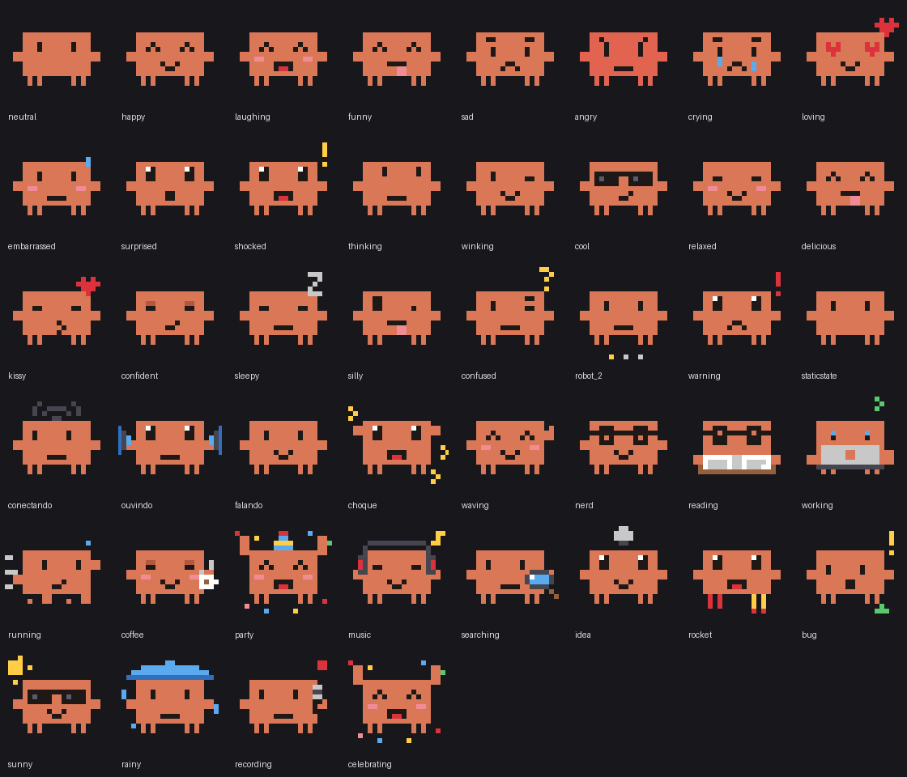

# Xiaozhi Ollie

**Keeps an eye on your agents, and steers them.**

**Website:** [gabrielvaz.github.io/xiaozhi-ollie](https://gabrielvaz.github.io/xiaozhi-ollie/), with a live mockup of the Watcher.

Xiaozhi Ollie is a modified version of the open-source [XiaoZhi](https://github.com/78/xiaozhi-esp32) firmware that turns the **SenseCAP Watcher** (Seeed Studio) into a voice companion for your desk. Say **“Hey Ollie”** to check on your Claude Code and Codex sessions, approve a request, record a meeting or see how much of your Claude plan is left. Clawd, the pixel-art mascot, shows what is going on.

It talks to a small server that you run on your own Mac, not to the xiaozhi.me cloud. Your keys and your access stay with you.



**Works with:** Claude Code · Codex · [herdr](https://herdr.dev) · macOS · Multica (optional)

**4 languages:** English · Português (Brasil) · 简体中文 · Español. The whole experience follows the language you pick: screen, apps, alerts, voice and the assistant's answers. Set `IDIOMA` in `servidor/.env`; the firmware build uses the same value. The wake word is “Hey Ollie” in every language.

## What it does

| You say or do | What happens |
|---|---|
| “How are my sessions doing?” | Lists your herdr sessions: which are working, which are waiting for you, which have subagents, what they finished |
| “Tell the api session to run the tests” | Repeats the request, asks you to confirm, then sends it |
| “Approve it” | Answers a permission prompt in a Claude Code or Codex session, after you confirm |
| “Ask Claude how the open PR is going” | Runs `claude -p` on your Mac in read-only mode and reads the answer out loud |
| “Open a Codex session on the docs repo” | Starts a new session in herdr |
| “How much of my Claude plan have I used?” | 5-hour and weekly usage, and when each resets |
| “Remember that…” | Saves a reminder to iCloud Drive and to the offline memory on the microSD card |
| Click the wheel three times | Opens the app drawer |

**On the device**

- **App drawer** on the wheel: Claude Code sessions, conversations, Claude usage, weather, meeting recorder, stopwatch, countdown, world clock, QR codes, offline memory, card backup and settings.
- **Alerts** on screen when a session is waiting for you, a task finishes or a meeting summary is ready.
- **Clawd** reacts to everything: emotions picked by the model, device states (listening, thinking, talking) and poses (working, running, deploying, celebrating).
- **Meeting recorder**: audio goes to the Mac for a transcript, summary, decisions and next steps in Apple Notes. Offline, it keeps recording to the microSD card.
- **Offline memory**: sessions, recent meetings and reminders, with audio, stored on the card for when there is no internet.
- **Settings**: agent name and wake word (Ollie, Clawd, Jarvis, Nova, Atlas, Luna, Max or Iris), theme, font (Noto Sans or JetBrains Mono), brightness, volume, alerts.

**Wheel controls**

| Gesture | Result |
|---|---|
| 1 click | Talk (click again to interrupt). With the screen off, the first click only wakes the screen |
| 2 clicks | Back |
| 3 clicks | Open or close the app drawer |
| Turn | Volume on the home screen; navigation in the drawer |
| Hold 2 s (on battery) | Power off |
| Hold 20 s | Factory reset (erases saved Wi-Fi) |

## How it works

```
SenseCAP Watcher (Xiaozhi Ollie firmware)
  │  home Wi-Fi or phone hotspot · wss / https
  ▼
Tailscale Funnel ── only one secret path is public; the root returns 404
  ▼
xiaozhi-server on your Mac (127.0.0.1) ── any OpenAI-compatible API: speech-to-text, model, text-to-speech
  ▼ MCP (stdio)
ponte-mcp ── herdr sessions · claude -p · codex exec · multica · macOS Shortcuts
```

- **Firmware** (`firmwares/xiaozhi-ollie/`): patches applied on top of a clean XiaoZhi v2.5.0, so upstream updates can be followed without maintaining a fork.
- **Server** (`servidor/`): the [xiaozhi-esp32-server](https://github.com/xinnan-tech/xiaozhi-esp32-server) at a pinned commit, plus translations, extra routes and the MCP bridge.

## Devices

| Device | Support |
|---|---|
| **SenseCAP Watcher** | Full: everything above |
| **Other XiaoZhi devices** (ESP32-S3-BOX-3, M5Stack CoreS3, Waveshare round displays and many more) | Voice assistant and agent tools: point the “Custom OTA URL” of the XiaoZhi Wi-Fi setup page to your Ollie server. The drawer, wheel and Clawd screens are Watcher-only for now. Not tested yet |

## Security

- Anything that changes something (sending to a session, approving, opening a session, running a Shortcut) asks you to **confirm by voice** first.
- Questions to Claude and Codex run **read-only**.
- **No free-form shell.** Mac actions go through Shortcuts only; keys sent to sessions are limited to enter, esc, tab, arrows, y/n, 1–4 and ctrl+c.
- The server listens on `127.0.0.1` only. The internet reaches it through Tailscale Funnel, on a random 32-character path, and the WebSocket requires a signed token.
- What leaves your Mac: audio, text and tool results, sent to the API provider you configure. Nothing goes to xiaozhi.me.
- `servidor/.env` (keys and secrets) and `firmwares/backups/` (which hold your Wi-Fi passwords) are never committed.

## Install

Follow **[docs/INSTALL.md](docs/INSTALL.md)**. It walks through the server, Tailscale, building and flashing the firmware, and Wi-Fi setup, and it includes a ready-made prompt to let **Claude Code, Codex or another coding agent** do the setup with you.

Short version, on a Mac:

```sh
servidor/instalar.sh                   # server, Python env and .env with fresh secrets
#   fill API_KEY, HOST_PUBLICO, NOME_USUARIO and IDIOMA in servidor/.env
servidor/testar-api.sh                 # real chat, voice and transcription calls
servidor/configurar-funnel.sh ligar    # public secret path through Tailscale Funnel
servidor/instalar-servico.sh instalar  # starts at login, restarts if it crashes
firmwares/xiaozhi-ollie/compilar.sh    # builds the firmware with your server address and language
firmwares/gravar-xiaozhi.sh            # first flash, with a full backup
```

## Repository layout

| Path | Contents |
|---|---|
| `servidor/` | Voice server setup, MCP bridge (`ponte-mcp/ponte.py`), patches and service scripts ([README](servidor/README.md)) |
| `firmwares/xiaozhi-ollie/` | Firmware: `compilar.sh`, `aplicar_patches.py`, the app platform in `placa/`, fonts, mascot ([README](firmwares/xiaozhi-ollie/README.md)) |
| `firmwares/xiaozhi-ollie/placa/apps/` | One file per app; see [placa/README.md](firmwares/xiaozhi-ollie/placa/README.md) to write your own |
| `firmwares/xiaozhi-ollie/mascote-clawd/` | `gerar.py` draws every Clawd GIF |
| `firmwares/gravar-xiaozhi.sh` | First flash: backs up the whole flash and keeps the factory partition |
| `firmwares/atualizar-firmware.sh` | Later updates: keeps Wi-Fi and settings |
| `site/` | Landing page with a live Watcher mockup |
| `docs/` | Install guide and hardware notes |

Third-party code is not stored here. The scripts download [xiaozhi-esp32](https://github.com/78/xiaozhi-esp32) v2.5.0, [esp-wifi-connect](https://github.com/78/esp-wifi-connect) 3.3.1 and [xiaozhi-esp32-server](https://github.com/xinnan-tech/xiaozhi-esp32-server) at pinned versions and apply the patches.

## License

MIT, see [LICENSE](LICENSE). The upstream projects keep their own licenses; the build scripts download them at pinned versions.

## Credits

- [XiaoZhi](https://github.com/78/xiaozhi-esp32) (MIT) and [xiaozhi-esp32-server](https://github.com/xinnan-tech/xiaozhi-esp32-server), the projects this one modifies.
- Fonts: [Noto Sans](https://github.com/notofonts/latin-greek-cyrillic), [JetBrains Mono](https://github.com/JetBrains/JetBrainsMono) and [Inter](https://github.com/rsms/inter), all under the SIL Open Font License.

Clawd is the Claude Code mascot, by Anthropic. Claude Code, Codex, herdr, macOS and SenseCAP are trademarks of their owners. This is an independent project with no affiliation to Anthropic, OpenAI, Apple, Seeed Studio or the XiaoZhi project.
